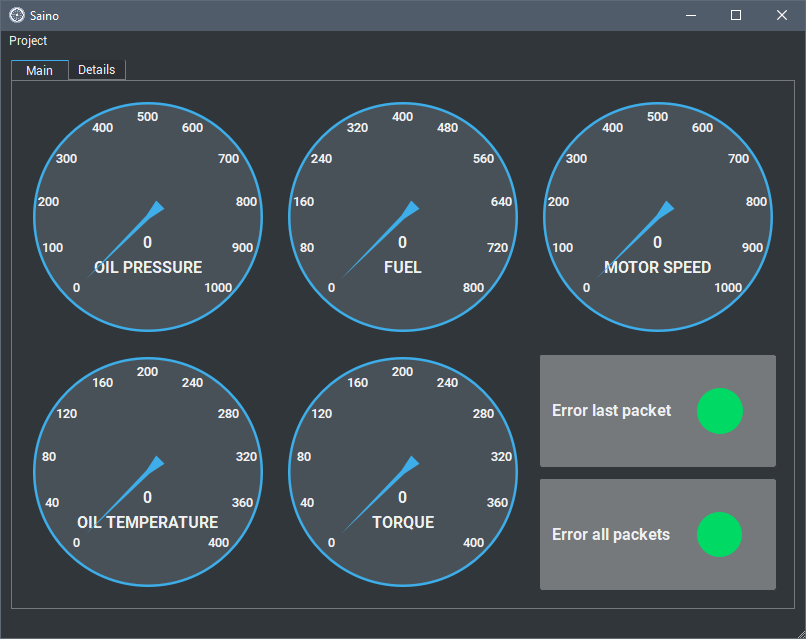
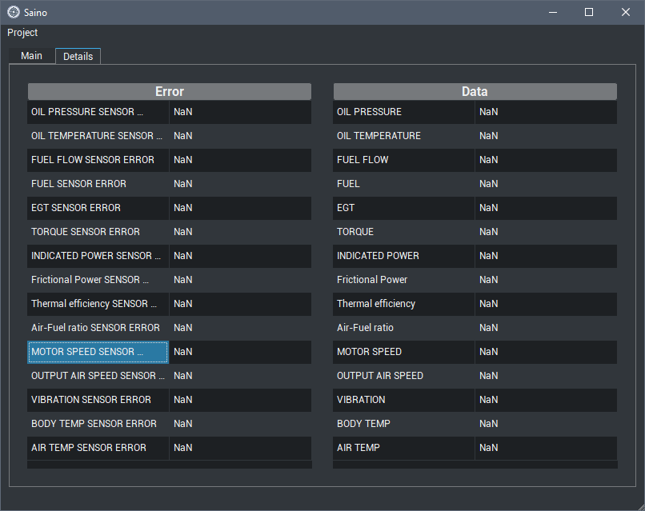

## Engine Data Monitor – A Qt5 C++ Application  

🛠️ **Engine Data Monitor** is a desktop application built with Qt5 (C++) for capturing, monitoring, and exporting sensor data from airplane engine probes. The UI features a custom dark theme and real-time data visualization.  

This project is shared for **educational purposes** and is especially useful for those interested in working with serial ports, custom widgets, and Excel file generation using C++.  

### ✨ Features  
- **Custom Circular Gauge** – Real-time visual feedback for sensor values.  
- **Dark Theme (QSS)** – Clean and modern look using Qt Style Sheets.  
- **Serial Port Integration** – Communicate with external hardware (test script included).  
- **Excel Export** – Save recorded data in `.xlsx` format.  
- **Responsive Layout** – Scales well on different screen sizes.  

### 📸 Screenshots  

### 📚 Learn from This Project  
Explore this project to get hands-on experience with:  
- **Qt5 Widgets and Layouts**  
- **Creating custom widgets (gauges)**  
- **Serial communication in C++ with Qt**  
- **Exporting data to Excel**  

### 📜 License  
This project is provided as-is for **educational use**. Dive into the code and discover how it all works! You may also use any of the components under GPLv3. 
